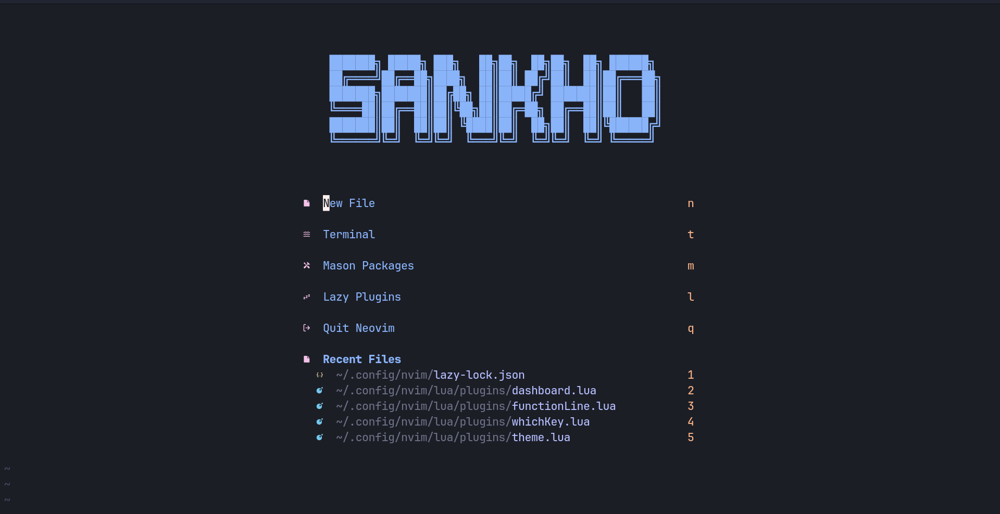
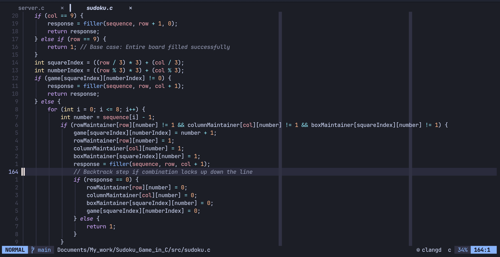
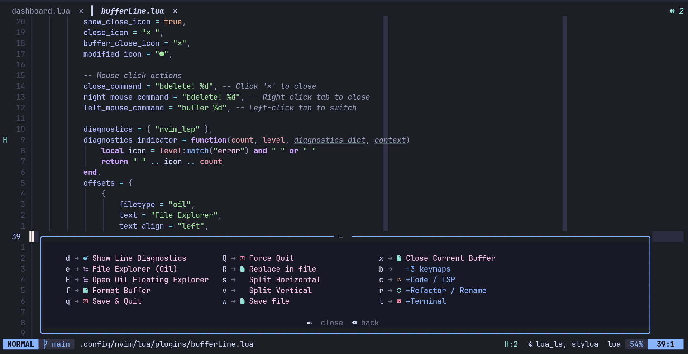
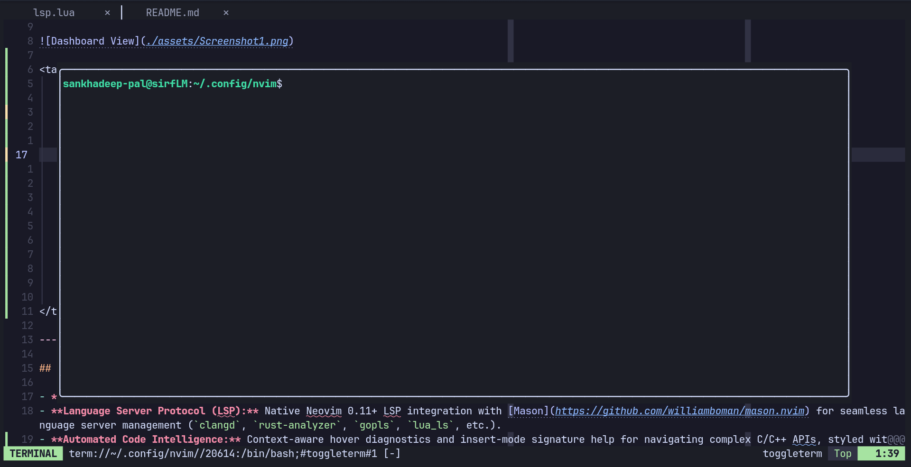
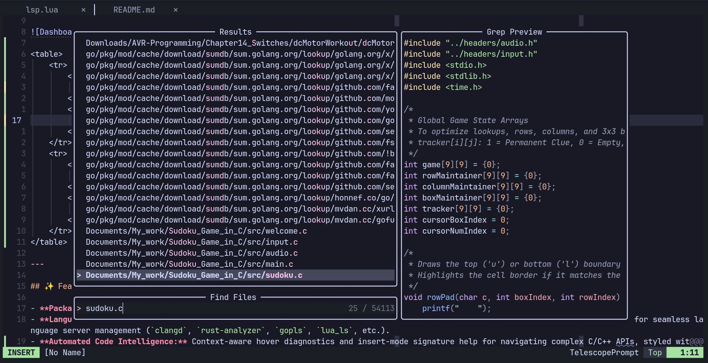

# ⚡ Neovim Configuration

A clean, blazing-fast, and modern Neovim setup built with **Lua** and **Lazy.nvim**, tailored for low-level systems programming (C, C++, Rust, Assembly) and general software development.

---

## 📸 Screenshots



<table>
    <tr>
        <td>
            
        </td>
        <td>
            
        </td>
    </tr>
    <tr>
        <td>
            
        </td>
        <td>
            
        </td>
    </tr>
</table>

---

## ✨ Features

- **Package Management:** Powered by [lazy.nvim](https://github.com/folke/lazy.nvim) for rapid, on-demand plugin loading.
- **Language Server Protocol (LSP):** Native Neovim 0.11+ LSP integration with [Mason](https://github.com/williamboman/mason.nvim) for seamless language server management (`clangd`, `rust-analyzer`, `gopls`, `lua_ls`, etc.).
- **Automated Code Intelligence:** Context-aware hover diagnostics and insert-mode signature help for navigating complex C/C++ APIs, styled with custom rounded borders.
- **Fuzzy Finding:** Deep project navigation, grep searching, and visual LSP menus powered by [telescope.nvim](https://github.com/nvim-telescope/telescope.nvim).
- **Rapid Context Switching:** Instant, keystroke-free jumping between active workbench files using [harpoon 2](https://github.com/ThePrimeagen/harpoon).
- **Syntax & Parsing:** Advanced syntax highlighting, indentation, and sticky context via [nvim-treesitter](https://github.com/nvim-treesitter/nvim-treesitter).
- **Buffer & Status Line:** Pinned global statusline with [lualine.nvim](https://github.com/nvim-lualine/lualine.nvim) and clickable tabs via [bufferline.nvim](https://github.com/akinsho/bufferline.nvim).
- **File Management:** Minimal buffer-like filesystem navigation using [oil.nvim](https://github.com/stevearc/oil.nvim).
- **Embedded Terminal & Git:** Floating and split terminal management with [toggleterm.nvim](https://github.com/akinsho/toggleterm.nvim), natively supporting tokenless GitHub CLI (`gh`) authentication.
- **Interactive Helper:** Command discovery and keymap menu via [which-key.nvim](https://github.com/folke/which-key.nvim).
- **Autocomplete & Snippets:** Intelligent completion using [nvim-cmp](https://github.com/hrsh7th/nvim-cmp) and [LuaSnip](https://github.com/L3MON4D3/LuaSnip).
- **Theme:** Minimal and high-contrast [Catppuccin](https://github.com/catppuccin/nvim).

---

## 📂 Project Structure

    ~/.config/nvim/
    ├── init.lua
    └── lua/
        ├── config/
        │   ├── autocmds.lua     # Global autocommands
        │   ├── keymaps.lua      # Core keybindings
        │   ├── lazy.lua         # Lazy.nvim bootstrapping
        │   └── options.lua      # Editor settings (indentation, cmdheight, mouse, etc.)
        └── plugins/
            ├── autoPairs.lua    # Automatic bracket/quote closing
            ├── bufferLine.lua   # Buffer tabs and click actions
            ├── completion.lua   # nvim-cmp autocompletion engine
            ├── dashboard.lua    # Startup dashboard (snacks.nvim)
            ├── fileManager.lua  # Oil.nvim file manager
            ├── formatting.lua   # Code formatting integration
            ├── functionLine.lua # Scope lines & sticky context
            ├── harpoon.lua      # Harpoon 2 rapid file switching
            ├── icon.lua         # Mini.icons / devicons
            ├── lsp.lua          # Native LSP configurations, auto-hovers & keymaps
            ├── luaLine.lua      # Pinned global statusline & showcmd
            ├── mason.lua        # LSP, Linter & Formatter installer
            ├── snippets.lua     # Snippet expansion engine
            ├── telescope.lua    # Fuzzy finder & LSP UI integration
            ├── terminal.lua     # ToggleTerm configuration
            ├── theme.lua        # Theme setup (Catppuccin)
            ├── treesitter.lua   # Treesitter grammar parsers
            └── whichKey.lua     # Keybinding menu & spell helpers

---

## 📋 Prerequisites

- **Neovim** >= `v0.10.0` (Recommended: `v0.11+`)
- **Git** & **GitHub CLI (`gh`)** (For seamless terminal authentication)
- A **[Nerd Font](https://www.nerdfonts.com/)** (e.g., JetBrains Mono Nerd Font, FiraCode Nerd Font)
- **C/C++ Compiler Toolchain** (`gcc`, `clang`, `make`)
- **Build EAR (`bear`)** or **CMake** (For generating `compile_commands.json` for `clangd`)
- **Node.js** & **npm** (Required by Mason for specific LSPs/formatters)
- **Ripgrep** (`rg`) (Required for Telescope text searching)

---

## 🚀 Installation

1.  **Back up your existing configuration (optional):**

    ```bash
    mv ~/.config/nvim ~/.config/nvim.backup
    mv ~/.local/share/nvim ~/.local/share/nvim.backup
    mv ~/.local/state/nvim ~/.local/state/nvim.backup
    mv ~/.cache/nvim ~/.cache/nvim.backup
    ```

2.  **Clone this repository:**

    ```bash
    git clone [https://github.com/Sankhadeep-Pal/nvim-config.git](https://github.com/Sankhadeep-Pal/nvim-config.git) ~/.config/nvim
    ```

3.  **Authenticate GitHub CLI (Optional but recommended):**

    ```bash
    gh auth login
    ```

4.  **Launch Neovim:**
    ```bash
    nvim
    ```
    _Lazy.nvim will automatically bootstrap and install all configured plugins on the first run._

---

## ⌨️ Key Bindings Overview

_The leader key is mapped to `Space`._

### Core & Navigation

| Key                | Action                    |
| :----------------- | :------------------------ |
| `<leader>e`        | Open File Explorer (Oil)  |
| `<Tab>`            | Switch to Next Buffer     |
| `<S-Tab>`          | Switch to Previous Buffer |
| `<leader>x`        | Close Current Buffer      |
| `<C-/>` or `<C-_>` | Toggle Line Comment       |

### Telescope (Search & Find)

| Key          | Action                             |
| :----------- | :--------------------------------- |
| `<leader>sf` | Find Files                         |
| `<leader>sg` | Live Grep (Search Text in Project) |
| `<leader>sw` | Grep Word Under Cursor             |
| `<leader>sr` | Recent Files                       |
| `<leader>sz` | Fuzzy Find in Current Buffer       |

### Harpoon (Rapid Workbench)

| Key         | Action                      |
| :---------- | :-------------------------- |
| `<leader>a` | Add Current File to Harpoon |
| `<C-e>`     | Toggle Harpoon Quick Menu   |
| `<C-h>`     | Jump to Harpoon File 1      |
| `<C-t>`     | Jump to Harpoon File 2      |
| `<C-n>`     | Jump to Harpoon File 3      |
| `<C-s>`     | Jump to Harpoon File 4      |

### LSP & Code Intelligence (Telescope Powered)

| Key          | Action                           |
| :----------- | :------------------------------- |
| `gd`         | Go to Definition (Telescope)     |
| `gD`         | Go to Declaration                |
| `gr`         | Find References (Telescope)      |
| `gi`         | Go to Implementation (Telescope) |
| `K`          | Hover Documentation              |
| `<leader>ds` | Document Symbols (Telescope)     |
| `<leader>ws` | Workspace Symbols (Telescope)    |
| `<leader>ca` | Code Action                      |
| `<leader>rn` | Rename Symbol                    |
| `<leader>d`  | Open Line Diagnostics (Manual)   |
| `[d` / `]d`  | Previous / Next Diagnostic       |

### Terminal & Tools

| Key          | Action                              |
| :----------- | :---------------------------------- |
| `<leader>t`  | Toggle Floating Terminal            |
| `<leader>th` | Toggle Horizontal Terminal          |
| `<leader>tv` | Toggle Vertical Terminal            |
| `<leader>s`  | Spell Suggestions & Dictionary Menu |

---
